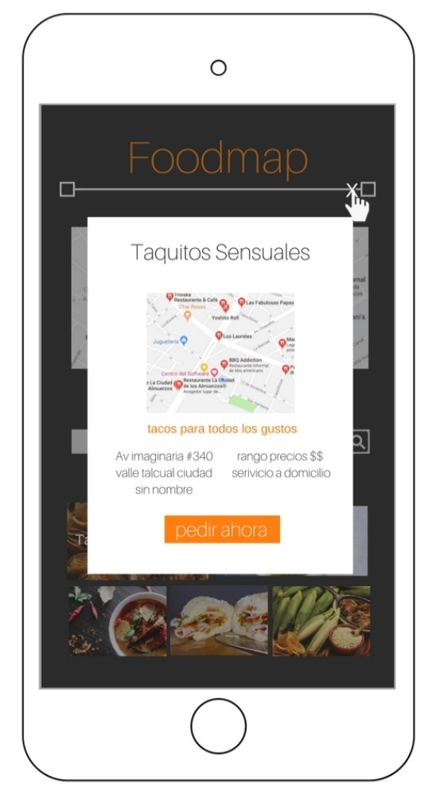

# FOODMAP

* **Descripcion General:** _Web-app con diseño libre, utilizamos JQUERY Y BOOTSTRAP_
* **Reto** 
* **Contenido** 
* **Visualiza el restultado final** : https://kamalyzl.github.io/FOODMAP/
***

## Reto

El reto consiste en crea una web-app que a través de un input pueda filtrar los restaurantes que se encuentran cerca de ti ( la esttructura de los datos, así como el diseño es propio)
## Flujo de la aplicación

* Vista splash con duración de 2 a 5 segundos que redirecciona a tu vista principal. 

* En la vista principal se muestran todos los restaurantes "cerca de ti" junto con el input para filtrar tu elección. 

* Luego de la selección deben mostrarse únicamente aquellos restaurantes que cumplan con la condición. 

* Se agrega un evento mouseover a las imágenes para crear un efecto.  

* Al seleccionar alguno de los restaurantes, deberá mostrarse la información de este a través de un modal.  

* Una vez cerrado el modal debe volver a la vista principal.  
 
 

## Contenido

* En el archivo base `index.html` se encuentra el maquetado.

* En la carpeta `css` se encuentra elarchivo base `main.css` donde se encuentran los estilos necesarios no realizacionados al bootstrap.

* En la carpeta `js` se encuentra elarchivo base `app,js` donde se encuentra toda la funcionalidad en jquery.

* En la carpeta `Vendors` se encuentra los archivos del framework utilizado.

 **Autora:** _Kamaly Zapana Lorenzo_

